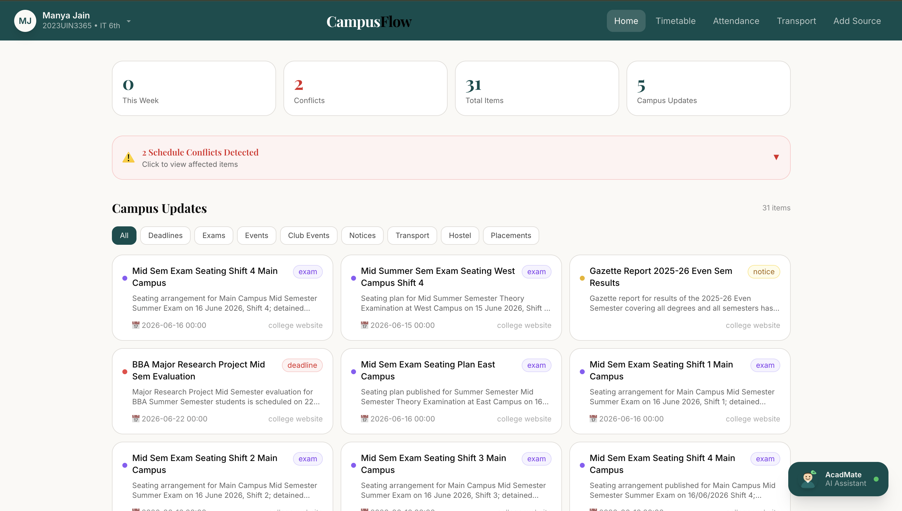
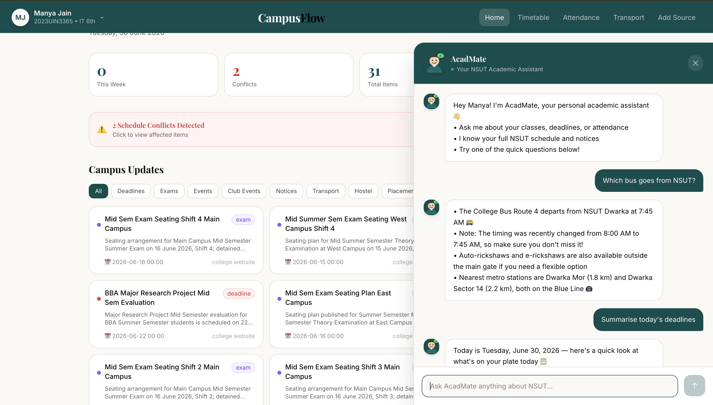

# 🎓 CampusFlow — AI Operating System for Student Life

<p align="center">
  <strong>One unified AI-powered platform for every student's academic and campus life.</strong>
</p>

<p align="center">
  <a href="https://campusflow-nsut-tau.vercel.app/"></a>
</p>

<p align="center">
  
  
  
  
  
</p>

---

## 📸 Preview

### Dashboard


### AcadMate AI Assistant


---

## 📖 Overview

Student life runs on chaos — class schedules, assignment deadlines, club events, attendance, transport, hostel notices, placement prep, and exam stress are spread across **WhatsApp groups, emails, college portals, and PDFs**. Important updates are constantly missed.

**CampusFlow** is a unified AI-powered campus assistant that:
- Understands a student's routine
- Summarizes important updates instantly
- Organizes schedules intelligently
- Answers campus questions via AI chat
- Proactively surfaces deadlines and conflicts

Built for **NSUT (Netaji Subhas University of Technology), Delhi** · **Amazon Hackathon 2026**

---

## 🎯 Problem

| Pain Point | Impact |
|---|---|
| 💬 WhatsApp Overload | Critical notices buried under 200+ daily messages across 10+ groups |
| 📋 Portal Chaos | Attendance, results, schedules across 3+ different ERP portals |
| 📅 Missed Deadlines | Assignment submissions and exam dates slipping through the cracks |
| 📄 PDF Overload | Unread circulars piling up with no summary |

---

## ✨ Features

| Feature | Description |
|---|---|
| 🤖 **AcadMate AI** | Ask anything in natural language — classes, attendance, deadlines, notices |
| 📥 **Add Source** | Paste WhatsApp/Email/PDF/Portal text → AI extracts all events automatically |
| ⚠️ **Conflict Detection** | Auto-flags clashing exams, deadlines, and placement drives |
| 📅 **Smart Timetable** | Weekly schedule with today highlighted, room numbers, time slots |
| 📊 **Attendance Tracker** | Subject-wise % with can-skip calculations and live updates |
| 🚌 **Transport Guide** | NSUT map, metro stations by distance, bus routes |
| 🔄 **Live NSUT Sync** | Real-time notice scraping from official NSUT website |
| 👤 **Student Profile** | Always-accessible profile across every page |

---

## 🏗️ Architecture
Multi-Source Input (WhatsApp · PDF · Email · Portal · NSUT Scraper)
↓
AI Processing — Anthropic Claude Sonnet 4.6
(Extraction → Classification → Conflict Detection)
↓
Supabase Postgres + Row Level Security + Auth
↓
Next.js 14 API Routes (/api/ingest · /api/chat · /api/scrape)
↓
React · Tailwind CSS · shadcn/ui
↓
Vercel Edge Network (Global CDN · Auto-scaling)
---

## 🛠️ Tech Stack

| Layer | Technology |
|---|---|
| **Frontend** | Next.js 14 (App Router), React, TypeScript |
| **Styling** | Tailwind CSS, shadcn/ui, Playfair Display + Inter |
| **Backend** | Next.js API Routes (serverless) |
| **Database** | Supabase (PostgreSQL + RLS) |
| **Auth** | Supabase Auth |
| **AI** | Anthropic Claude Sonnet 4.6 |
| **Scraping** | Cheerio |
| **Deployment** | Vercel |

---

## 🚀 Getting Started

### Prerequisites
- Node.js 20+
- [Supabase](https://supabase.com) account
- [Anthropic API key](https://console.anthropic.com)

### Installation

```bash
# Clone the repo
git clone https://github.com/manyajain10/Campusflow_NSUT.git
cd Campusflow_NSUT

# Install dependencies
npm install

# Set up environment variables
cp .env.example .env.local
# Add your keys to .env.local
```

```env
NEXT_PUBLIC_SUPABASE_URL=your_supabase_url
NEXT_PUBLIC_SUPABASE_ANON_KEY=your_supabase_anon_key
ANTHROPIC_API_KEY=your_anthropic_api_key
```

```bash
# Run development server
npm run dev
```

Open [http://localhost:3000](http://localhost:3000)

### Database Setup

Run this in your Supabase SQL Editor:

```sql
create table items (
  id uuid default gen_random_uuid() primary key,
  user_id uuid references auth.users not null,
  type text not null,
  title text not null,
  description text,
  due_date timestamp with time zone,
  priority text default 'medium',
  source text,
  conflict boolean default false,
  created_at timestamp with time zone default now()
);

create table sources (
  id uuid default gen_random_uuid() primary key,
  user_id uuid references auth.users not null,
  raw_text text not null,
  created_at timestamp with time zone default now()
);

create table chat_history (
  id uuid default gen_random_uuid() primary key,
  user_id uuid references auth.users not null,
  role text not null,
  message text not null,
  created_at timestamp with time zone default now()
);

alter table items enable row level security;
alter table sources enable row level security;
alter table chat_history enable row level security;

create policy "Users access own items" on items for all using (auth.uid() = user_id);
create policy "Users access own sources" on sources for all using (auth.uid() = user_id);
create policy "Users access own chats" on chat_history for all using (auth.uid() = user_id);
```

---

## 🗺️ Roadmap

- [ ] Multi-university expansion (DU, IITs, NITs)
- [ ] Live ERP attendance sync
- [ ] Voice-based AcadMate
- [ ] Proactive push notifications
- [ ] Study schedule optimizer
- [ ] Mobile app (React Native)

---

## 👤 Author

**Manya Jain**
2023UIN3365 · Information Technology · 6th Semester
Netaji Subhas University of Technology (NSUT), Dwarka, Delhi

[](https://linkedin.com/in/your-linkedin-here)

---

<p align="center">
  <a href="https://campusflow-nsut-tau.vercel.app/">
    
  </a>
</p>

<p align="center"><strong>Built with ❤️ for NSUT students · Amazon Hackathon 2026</strong></p>
